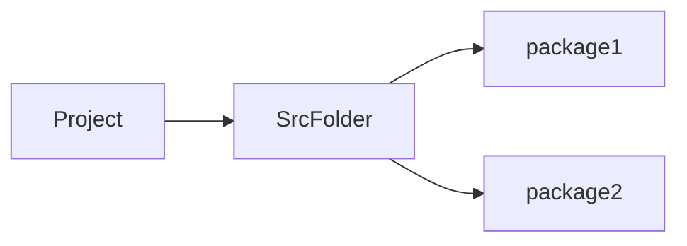

# 第二章 数据库基础及操作
[TOC]
# JDBC

## Definition
Q: What is JDBC?
A: Java DataBase Connectivity, an API to modify the database via Java

## Priority
- 各数据商使用相同接口
- 可用于不同数据库
- 更换数据库只需替换相应的数据库驱动
eg.导入MySQL数据库驱动包来使用MySQL数据库

## Work Flow
1. Java Language Coding
2. Sending SQL Code to MySQL
3. Exagerating SQL Code
4. Return the result to Java

## Usage
1. Creating a project, import the driver jar package
2. Registry the driver
3. Connect to database
4. Define SQL Code
5. Get SQL object
6. Exagerate Code
7. Show the result
8. Release the resources

# JDBC API

## PreparedStatement使用
# 数据库连接池

# 练习：商品品牌数据增删改查
## Tasks
- [ ] 增加品牌
- [ ] 修改比亚迪Slogan
- [ ] 删除三只松鼠和小米

## Project Structures

## General Coding Flow
1. 设置属性
2. 生成Getter&Setter: <kbd>Alt</kbd> + <kbd>Enter</kbd>
### Create the entity class: Brand

### SelectALL Function
1. Load Config File
   - 找不到路径: 打印出来
   ``` Java
   System.out.println(System.getProperty("user.dir"));
   ```
2. SQL Code
3. Handle with the result `List<Brand>`
   ```Java {.line-numbers}
    while (rs.next()) {
    String column1 = rs.getString("column1"); // 替换为你的列名
    int column2 = rs.getInt("column2"); // 替换为你的列名
    // 你可以继续获取更多的列...
    }
   ```s

### SelectById
1. 创建`BrandSelectById`类，根据id查询
2. Load Config File..(Same as the SelectALL)
3. SQL Code
   1. Set id property
4. Handle with the result `List<Brand>`